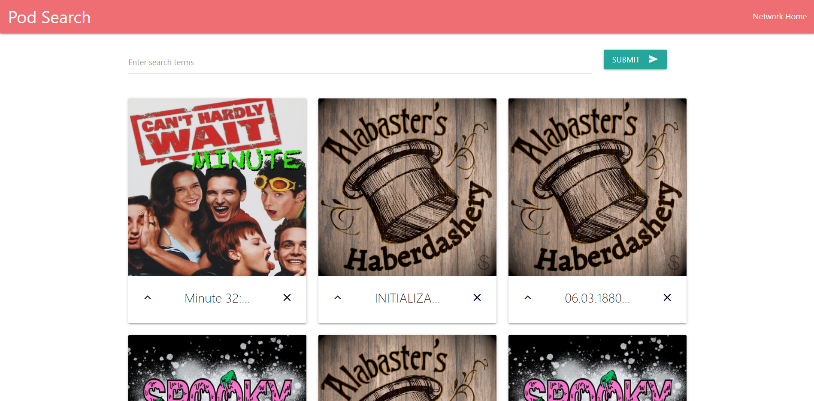
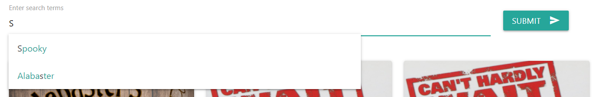
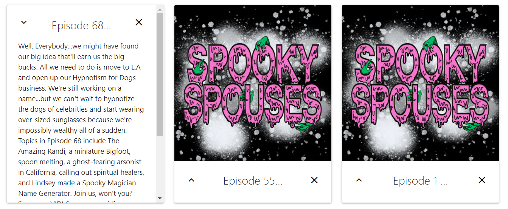

# Podcast-Finder

Looking for your next favorite podcast?

This app allows for users to find a podcast episode based on search term, whether for listeners looking for shows relevant to their interests or podcast hosts looking for relevant episodes to recommend. The [project that updates the database](https://github.com/altays/ScavDB-Webcrawler) utilizes the MongoDB NodeJS driver and [RSS-To-JSON](https://www.npmjs.com/package/rss-to-json) to parse RSS feeds and create database entries for each episode.

***

## Table of Contents

1. [Installation](#Installation)
2. [Usage](#Usage)
3. [License](#License)
4. [Questions](#Questions)

***

## Usage

Enter any term into the search bar. The database combines any search into an OR search for podcast name, episode title, and episode description.

If your query returns any results, you will get a list of up to 12 podcasts that match the criteria. Each card has the logo for the podcast and a truncated episode title. If you click on the arrow or the logo, the description and a link to the podcast's home page will show up over the card. If you want to remove a result, click the "x" on the right of the card.

If your search doesn't return any results, try another search or click on the "Pod Search" in the nav bar to return to the home menu. 

***

## License

Copyright (c) 2020 Alex Taylor.
Released under MIT. See the LICENSE file for more details.

***

## Questions

Have any suggestions? Reach out to me at altays633@gmail.com
